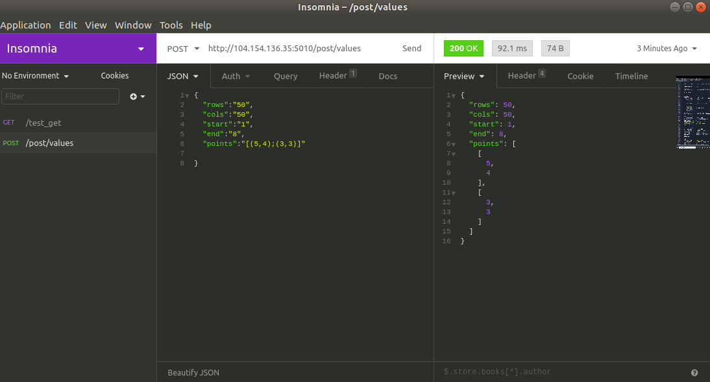

# cs5213s20-project-g4

### Authors - Nithivarn Reddy Shanigaram , Siva Rama Krishna Ghanta , Jagadish Chitturi

### Email - nithivarn.reddy.shanigaram-1@ou.edu , shivasrk1234@ou.edu , Jagadish.C.Chitturi-1@ou.edu

### MODEL
Corona virus disease model to find count of infected patients.

Input:

{Number of rows = rows 

Number of columns = cols.

Start date= start date in the term time frame 

End date= end date in the term time frame 

Infected patients’ locations = provided the infected patients locations as input.}

In a given matrix, each cell can have one of three values:

•	the value 0 representing an empty healthy person.

•	the value 1 representing a freshly infected person.

•	the value ‘A’ representing an antibody.

Presumptions: 

1.	Consistently, any healthy individual that is neighboring (8-directionally) to a tainted individual gets contaminated with infection.
2.	Here we are expecting that solitary 2 out of 8 adjacent individuals gets tainted randomly every day. So, we will take any 2 of the directions.

Output:

We have to locate the infected patients in between start date and end date.

Following is the step by step procedure for developing the application :

Step 1:
Firstly, we create the matrix with the provided row size and column size and fill the entire matrix with zeroes.

Step 2:
Secondly, we take 10 random locations and represent them as antibodies.

Step 3:
Thirdly, based on the infected locations provided, the matrix is filled with 1’s

Step 4:
Finally, we apply our graph algorithm for finding the infected patients 

1.	Also, to execute this model, we developed a REST API, a post api call is made for providing the data sources like row size of a matrix, column size of a matrix, tainted patients area, start date and end date. POST api - http://url:5010/post/values
The input format is similar to the following:
{ 
	"rows":"10",
	"cols":"10",
	"start":"1",
	"end":"7",
	"points":"[]"
}

2.	Then we have a GET API call through which we get the resultant grid after the end date. Furthermore, we get data with respect to number of patients tainted during the span.

### PROJECT SPECIFICATIONS

Version of python used for development - Python 3.7.5

Version of docker used for deployment - Docker version 19.03.6

REST client - Insomnia or PostMan

External Packages used 

> pytest

> flask

The following link directs you regarding installation of insomnia - [https://support.insomnia.rest/article/23-installation]

### Steps to access the model

For Posting the data (In the JSON Format)

Enter the below url in Postman or insomnia client

1) http://104.154.136.35:5010/post/values

For getting the results back, you can use the following url.

2) http://104.154.136.35:5010/get_final_infected

### Development Procedure.

1) We have developed the python code for the model and made it into REST api using flask.

2) We have also developed the testcases , which check whether the returned data is in the correct type and format.

3) We have achieved continuous integration and continuous deployment using github-actions.

## Workflow

#### CI.yml

This workflow gets triggered when we push code on to the development branch or when pull is raised on the master branch.

The first workflow checkouts our code into our self-hosted runner and installs all the required dependencies of project
and finally executes the testcases.

#### CD.yml

This workflow gets triggered when we push code on to the development branch or when pull is raised on the master branch.
Using this workflow we deploy our code into a docker container hosted inside our self-hosted runner and expose the API to the outer-world as a service.

We have designed this workflow such that each time the workflow is triggered we stop the exisiting container, destroy it, make a new docker image build and then we spin up our new instance.

### Assumptions made

1) You have your own self-hosted runner setuped . If not you can please find a easy way of doing it by going through link
[https://help.github.com/en/actions/hosting-your-own-runners/adding-self-hosted-runners]

2) You have Python3 and docker installed on your self-hosted runner instance. If not you can use the following commands

If your self-hosted runner is a Ubuntu based instance.

 > sudo add-apt-repository ppa:ubuntu-toolchain-r/ppa
 
 > sudo apt update
 
 > sudo apt install python3.7
 
 > sudo update-alternatives --install /usr/bin/python3 python3 /usr/bin/python3.6 1

 > sudo update-alternatives --install /usr/bin/python3 python3 /usr/bin/python3.7 2
 
 > sudo update-alternatives --config python3
 
 A detailed description is given in this link - [http://ubuntuhandbook.org/index.php/2019/02/install-python-3-7-ubuntu-18-04/]
 
If docker isn't installed 

Detailed steps for installation is given in the following link - [https://www.digitalocean.com/community/tutorials/how-to-install-and-use-docker-on-ubuntu-18-04]

### Screeshots

This the screenshot of how we make the call to the service.

This screenshot gets us the final matrix and the infected persons.

